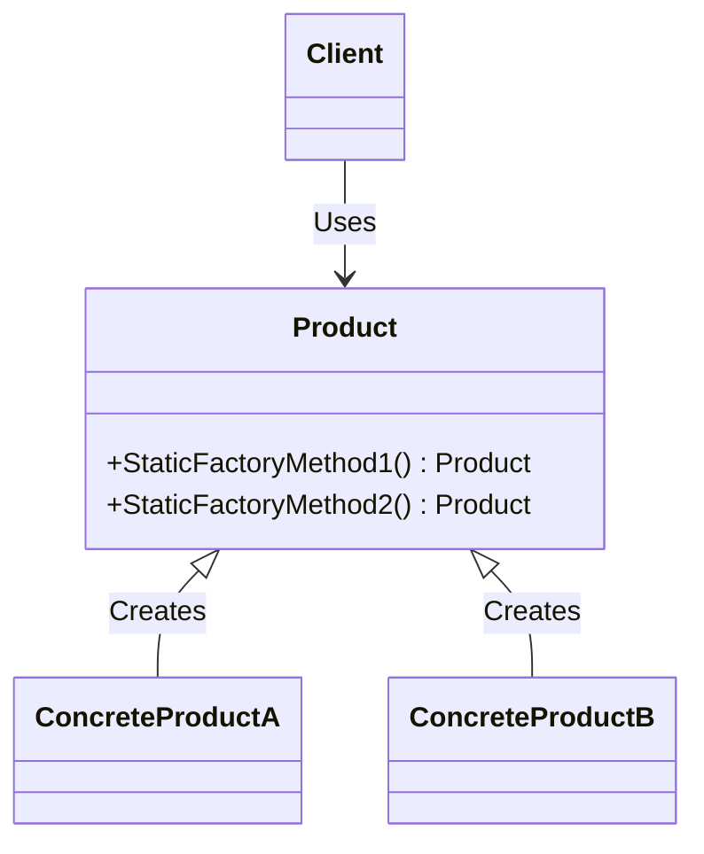

# Design Patterns - Static Factory Method

- [UML Diagram](#uml-diagram)
- [Intent](#intent)
- [Components](#components)
- [Pros and Cons](#pros-and-cons)
- [Applicability](#applicability)
  - [Overloading constructors](#overloading-constructors)
  - [Semantic factory method names](#semantic-factory-method-names)
  - [Multiple constructors](#multiple-constructors)
  - [Implicit operators in C#](#implicit-operators-in-c)
- [References](#references)


The term `Factory` is too much ambiguous, it can be confused with the `Static Factory Method`, `Simple Factory`, `Factory Method`, `Abstract Factory` because all of them are related to the creation of objects. In this article, we will focus on the  `Static Factory Method`.

The `Static Factory Method` isn't a design pattern cataloged by the Gang of Four, however, it is a common pattern used in many applications. The `Static Factory Method` even though can be considered a creational pattern.


## UML Diagram




## Intent

The `Static Factory Method` is a method is a design pattern that allows objects to be created without exposing the instantiation logic to the client. Instead, the client uses a static method provided by the factory to create objects. This static method returns an instance of the class, effectively encapsulating the object creation process.


## Components

- **Product**: The interface or abstract class that defines the type of objects that the factory method creates.
- **ConcreteProduct**: The concrete class that implements the Product interface.
- **Client**: The class that uses the factory method to create objects.


## Pros and Cons

- ✅ **Encapsulation**: The client doesn't need to know the instantiation logic.
- ✅ **Single Responsibility Principle**: The factory method is responsible for creating objects.
- ✅ **Code Reusability**: The factory method can be used to create objects in different parts of the application.
- ❌ **Hard to Extend**: The factory method can be hard to extend because it is a static method.
- ❌ **Hard to Mock**: The factory method can be hard to mock because it is a static method.


## Applicability

### Overloading constructors

One of the most common uses of the `Static Factory Method` is to provide an alternative to constructor overloading. Constructors do not allow for multiple constructors with the same parameter signature. The `Static Factory Method` circumvents this limitation by allowing the creation of static methods with different names but similar functionalities, enabling more flexible object instantiation.

[Implementation](./Dotnet/OverloadingConstructors/Program.cs)


### Semantic factory method names

Another common use of the `Static Factory Method` is to provide semantic names for object creation. Instead of using the constructor, the client can use a static method with a meaningful name to create objects. This approach makes the code more readable and self-explanatory.

[Implementation](./Dotnet/SemanticFactory/Program.cs)

**Some examples of semantic factory method names are `TimeSpan` in c#;
```csharp
TimeSpan.FromDays(1);
TimeSpan.FromHours(1);
TimeSpan.FromMinutes(1);
```


### Multiple constructors

Some languages, such as Python, doesn't support more than one constructor. In this case, the `Static Factory Method` can be used to provide multiple ways to create objects.

[Implementation](./Python/MultipleConstructors.py)


### Implicit operators in C#

C# has a modern implementation of the `Static Factory Method` using implicit operators. Implicit operators allow the creation of objects using the `new` keyword, but the instantiation logic is encapsulated in the implicit operator.

[Implementation](./Dotnet/ImplicitOperators/Program.cs)


## References
- [Refactoring](https://refactoring.guru/design-patterns/factory-comparison)
- [Other Design Patterns](https://github.com/NelsonBN/design-patterns)
